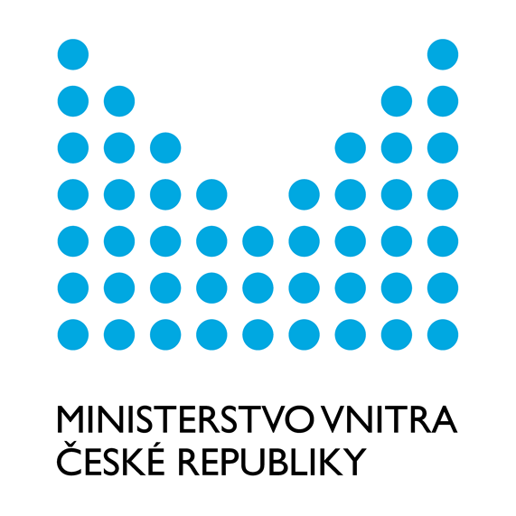

Poděkování
===============

Vývoj programu RadAgro for QGIS byl podpořen z projektu **Ministerstva
vnitra České republiky VI20172020098 Likvidace radiačně kontaminované
biomasy po havárii JE - distribuce v krajině, logistika sklizně,
využití bioplynovou technologií.**

