Uživatelská příručka je koncipována jako návod pro uživatele programu
RadAgro. Příručka shrnuje hlavní body práce s programem a upozorňuje
na důležité zásady při zadávání dat a nastavení parametrů pro výpočet
průběhu změn radioaktivní kontaminace jednotlivých ploch v zájmovém
území.

Instalace
=========

Instalace programu RadAgro je vcelku jednoduchá, vzhledem k tomu, že
je program koncipován jako plug-in programu QGIS. Odpadá tak potřeba
instalovat další software nutný pro práci programu.

Program RadAgro je ke stažení na GitHubu: https://github.com/JakubBrom/RadAgro.
Aktuální verzi programu stáhneme pomocí zeleného tlačítka Code ve
formátu zip. Program nainstalujeme do prostředí QGIS následovně:

    | 1. V hlavní nabídce klikneme na záložku Zásuvné moduly a dále
        Správa a instalace zásuvných modulů
    | 2. Zvolíme Instalovat ze ZIPu
    | 3. Najdeme stažený zip soubor s instalací programu RadAgro a
        klikneme na tlačítko Instalovat zásuvný modul
    | 4. Potvrdíme, že jsme si vědomi bezpečnostního rizika

V případě, že byl program správně nainstalován, QGIS napíše že
istalace proběhla v pořádku. Program se objeví v seznamu
nainstalovaných zásuvných modulů. V nabídce Zásuvné moduly se vytvoří
záložka RadAgro se spouštěčem. Obdobně se vytvoří ikona
|ico| na panelu nástrojů.

V budoucnu předpokládáme umístění programu RadAgro přímo do reozitáře
zásuvných modulů QGIS, takže nebude nutné program stahovat z
externích zdrojů.

Program RadAgro lze odinstalovat ve formuláři Správce zásuvných
modulů v programu QGIS.

Vstupní data
============

Program RadAgro je koncipován s ohledem na minimalizaci množství
vstupních dat. Předpokladem je využití dostupných vstupních dat,
jejichž příprava nepředstavuje neúměrnou zátěž. Využita jsou
prostorová (GIS) data a číselné hodnoty. Zásadní pro výpočet časoých
změn radioaktivní kontaminace území a jednotlivých ploch je správné
nastavení parametrů modelu, s ohledem na předpokládaný vývoj a
následná opatření po radiační havárii. Hlavními vstupy jsou:

    | 1. Rastrová vrstva depozice radionuklidu na zájmovém území.
        Depozice je uvedena jako měrná aktivita v :math:`Bq.m^{-2}`
    | 2. Rastrová vrstva úhrnu srážek v průběhu depozice radionuklidu
        (ca 24 - 48 hodin od radiační události). V případě, že není
        informace o prostorové distribuci úhrnu srážek k dispozici, lze
        zadat průměrnou hodnotu pro zájmové území. Úhrn srážek je
        udáván v mm.
    | 3. Vektorová vrstva plodin v zájmovém území. Hodnoty pro
        plodiny jsou textové.
    | 4. Vektorová vrstva hlavních půdních jednotek (1 - 78). Hodnoty
        pro HPJ jsou celočíselné.
    | 5. Rastrová vrstva digitálního modelu terénu, tzn. výškopis
        udávaný v m n. m.

Rastrové vrstvy mohou mít odlišné prostorové rozlišení (velikost
pixelu) a odlišný prostorový rozsah. Důležité je, aby se jednotlivé
vrstvy překrývaly. Program provede ořez vrstve na překryvnou plochu a
převzorkuje rastrové vrstvy na velikost nejmenšího použitého
prostorového rozlišení. Přestože program automaticky provádí
sjednocení geografického zobrazení použitých rastrů, **doporučujeme v
případě všech GIS vrstev použití shodných souřadnicových systémů**!

Vektorové vrstvy mohou mít odlišnou velikost, výpočet bude proveden
pouze pro překrývající se části rastrových a vektorových vrstev.
**Vektorové vrstvy musí mít shodné souřadnicové systémy**!

Vedle GIS vrstev musí uživatel zadat informace o osevním postupu,
případně o termínech seče trvalých travních porostů. Osevní postup je
pro zájmové území volen jako univerzální s ohledem na omezení
množství zadávaných dat. Podrobnosti jsou uvedeny dále.

Uživatel programu RadAgro může měnit a upravovat řadu přednastavených
parametrů a optimalizovat tak výpočet vývoje změn radioaktivní
kontaminace zájmového území.

Uživatelské rozhraní a zadávání dat
===================================

Spuštění aplikace
-----------------

Po spuštění programu pomocí ikony |ico| z panelu nástrojů nebo pomocí
spouštěče ze záložky Zásuvné moduly dojde ke spuštění uvítacího
informačního okna:

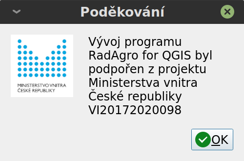

*Úvodní obrazovka programu RadAgro*

Uživatelské rozhraní
--------------------

Uživatelské rozhraní programu RadAgro se snaží o maximální
jednoduchost a přehlednost. Z tohoto důvodu je uživatelské okno
programu rozděleno do záložek, každá záložka pak obsahuje několik
listů. Uživatelské rozhraní se snaží navést uživate při zadávání dat
tak, aby byla data zadána správně a následný výpočet proběhl bez
obtíží. Následující obrázek ukazuje uživatelské rozhraní po spuštění

*Uživatelské prostředí programu RadAgro*

Vstupy
------

Záložka Vstupy shrnuje část programu, do které jsou zadávány externí
vstupy, jako jsou vektorové a rastrové vrstvy, číselné hodnoty apod.
V následujícím textu jsou popsány všechny vstupy a jejich vlastnosti.

Radioaktivní depozice a sledované období
+++++++++++++++++++++++++++++++++++++++++

List obsahuje hlavní nastavení výpočtu radioaktivní kontaminace a
její změny v čase. Nastavit lze následující vlastnosti:

    | 1. Vrstva depozice - rastrová vrstva měrné plošné aktivity
        radionuklidu :math:`(Bq.m^{-2})`
    | 2. Druh kontaminantu - v aktuální verzi programu lze volit bď
        cesium 137 a nebo stroncium 90.
    | 3. Datum radiační události - datum, kd došlo k úniku
        radionuklidu do prostředí
    | 4. Období predikce - nastavení konce časové řady. Odhad vývoje
        radioaktivní kontaminace je prováděn v měsíčním kroku. Doba,
        pro kterou je prováděn výpočet v podstatě není omezená, nicméně
        export dat do vektorvé vrstvy je omezen maximálním možným počtem
        sloupců, který je 2000, tzn., že maximální počet
        exportovaných měsíců je 1992, tj. 166 let. Pokud je zvoleno
        období delší než 166 let, respektive 1992 měsíců, je možné
        výsledky zobrazit v uživatelském rozhraní programu RadAgro v
        záložce Výsledky. Export je v takovém případ oříznut na
        prvních 1992 vypočtených měsíců. Při výpočtu je nicméně
        potřeba uvažovat účelnost, čas potřebný pro výpočet a uložení
        dat a dále následnou možnost s daty dále pracovat.
    | 5. Referenční úrovně depozice - stanovují hranice měrné
        aktivity pro kategorie tzv. referenčních úrovní. Jedná se o
        rozsah hodnot měrné aktivity, které neznamenají omezení
        aktivit v zájmovém prostoru (RU1), které mohou znamenat
        významná omezení aktivit v zájmovém prostoru (RU2) a nebo
        vymezují území, kde nelze provádět žádné další aktivity (RU3)
        . Vymezení těchto území je významné z důvodu aplikace
        následných opatření, jako je odstranění biomasy plodin,
        využití kultivace porostů a osevních postupů apod.
        Přednastavené hodnoty jsou :math:`5 \cdot 10^{3} \ Bq.m^{-2}` a
        :math:`3 \cdot 10^6 \ Bq.m^{-2}`.
    | 6. Odstranění biomasy v časné fázi radiační události -
        Odstranění biomasy v časné fázi radiační události, tzn. v co
        možná nejkratším období po radiační události (v řádu týdnů, max.
        měsíců) je naprosto zásadním momentem pro ochranu zemědělské
        půdy. V případě zaškrtnutí políčka je uvažováno plošné
        odstranění nadzemní biomasy plodin v zájmovém území a
        následné pokračování zemědělské činnosti (osevních postupů)
        až v roce následujícím.

Ukázka zadání dat a nastavení je na následujícím obrázku

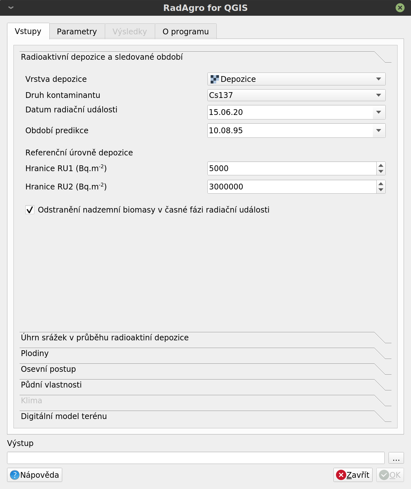

*Zadání dat radioaktivní kontaminace území*

Úhrn srážek v průběhu radioaktivní depozice
++++++++++++++++++++++++++++++++++++++++++++

Úhrn srážek představuje zásadní vstup, který rozhoduje o distribuci
radioaktivní depozice mezi porost (biomasu rostlin) a půdu v časné
fázi radiační události. Podrobnosti jsou uvedeny v technické
dokumentaci.

Úhrn srážek (v mm) představuje úhrn stážek za období depozice
radionuklidu v zájmovém území. Uvažováno je období v délce trvání
přibližně 24 až 48 hodin.

Úhrn srážek lze do programu zadat buď jako konstaní hodnotu pro celé
zájmové území a nebo ve formě rastrové vrstvy. Možnosti zadání jsou
uvedeny na následujícím snímku

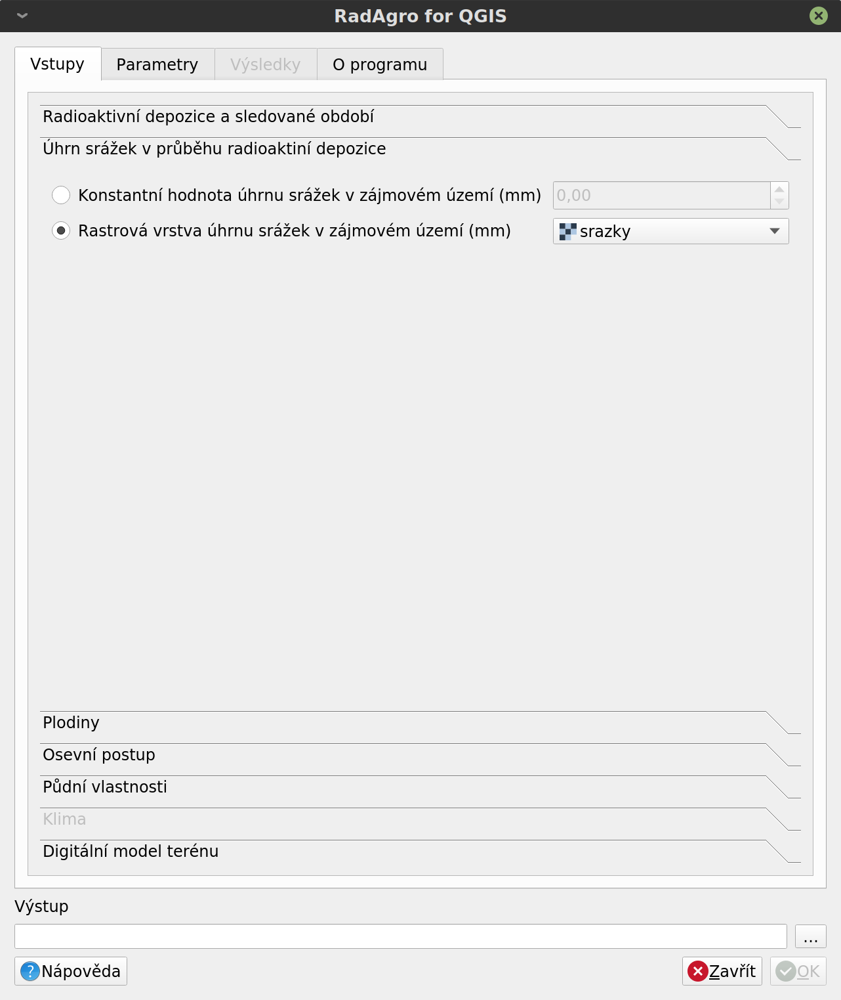

*Zadání úhrnu srážek v období depozice radionuklidu*

Plodiny
+++++++

Záložka Plodiny umožňuje volbu vektrové vrstvy obsahující informace o
distribuci plodin v zájmovém území a slouží k přiřazení jednotlivých
plodin. Postup zaání hodnot je následující:

    | 1. Uživatel zvolí vrstvu s plodinami a pole obsahující infromace o
        plodinách. Program automaticky načte přehled všech polí
        atributové tabulky vrstvy.
    | 2. živatel vybere pole s informací o výskytu plodin. Načtení
        polí může chvilku trvat. Po zvolení pole s plodinami dojde k
        vytvoření přehledu všech unikátních hodnot uvedených v
        tabulce. Ke každé hodnotě je zároveň přiřazen rozbalovací
        seznam s plodinami obsaženými v databázi programu. Hodnoty ve
        zvoleném poli by měly mít textový formát.
    | 3. Uživatel přiřadí odpovídající plodinu z databáze plodině
        obsažené ve vektorové vrstvě.

Přiřazení hodnot jednotlivým plodinám předpokládá dodržení
následujících zásad:

* Snažíme se přiřazovat hlavní plodiny. Meziplodiny (pro zelené
  hnojení) nemají z pohledu změny obsahu radionuklidů v prostředí
  zásadní význam, protože jejich biomasa zůstává na pozemku.
* Přiřazujeme plodiny, které budou obsaženy v osevním postupu. V
  případě, že je přiřazena plodina, která nebude dále obsažena v
  osevním postupu, bude pro danou plodinu vypočtena poze časná fáze
  radiační události
* Různým plodinám může být přiřazena stejná plodina (hodnota)

Uživatelské rozhraní programu s příkladem zadání hodnot je uvedeno na
následujícím obrázku:

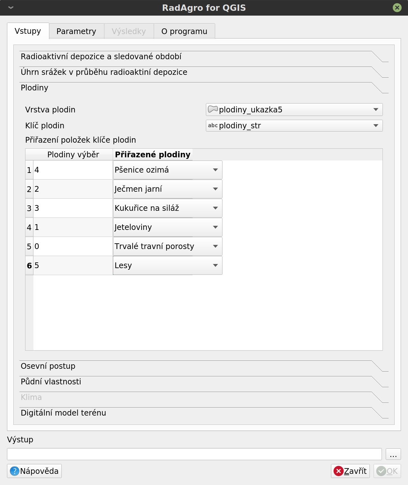

*Ukázka zadání plodin do programu RadAgro. V uvedeném případě jsou
pro plodiny obsažené ve vektorové vrstvě použity číselné kódy, které
mají nicméně textovou podobu.*

Osevní postup
+++++++++++++

Osevní postup je zadáván univerzálně pro celé zájmové území. Jedná se
o kompromisní řešení mezi složitostí přípravy zadávaných dat a
kvalitou výsledného výpočtu.

Program RadAgro na základě zadaného osevního postupu provádí výpočet
změn radioaktivní kontaminace na daných plochách, přičemž se ve všech
případech předpokládá odstranění nadzemní biomasy plodin v termínu
sklizně. Pro plodiny v osevním postupu jsou stanoveny termíny
setí/sadby a sklizně. Pro trvalé travní porosty jsou definovány
termíny sklizně. Předpokladem je opakování osevního postupu v čase. V
případě předpokládaných změn v osevním postupu může být výsledný
osevní postup kombinací několika osevních postupů.
Všechny uvedené termíny jsou v měsících.

Sestavení osevního postupu předpokládá střídání plodin. Opakované
zadání stejné plodiny v osevním postupu způsobuje v aktuální verzi
programu problémy. Doporučujeme plodiny v seznamu neopakovat. Jedná
se o známý problém, který bude řešen v další verzi programu.

Do osevního postupu může být zadána též plodina, která
není uvedena ve vstupní vektorové vrstvě. Tento postup nicméně
nedoporučujeme s ohledem na další výpočty, jako je eroze půdy a
přiřazení transferových koeficientů.

Program RadAgro předpokládá, že doba kultivace je v případě ozimů
maximálně jedenáct měsíců, tzn., že pokud je termín výsevu např. v
září, potom je termín sklizně v srpnu. Pokud je měsíc výsevu i
sklizně shodný, předpokládá se, že je doba kultivace pouze jeden měsíc!

Trvalé travní porosty mohou být až trojsečné. Zde je opět předpoklad
shodného managementu pro celé zájmové území.

Příklad zadání jednoduchého osevního postupu a termínů sečí ukazuje
následující obrázek:

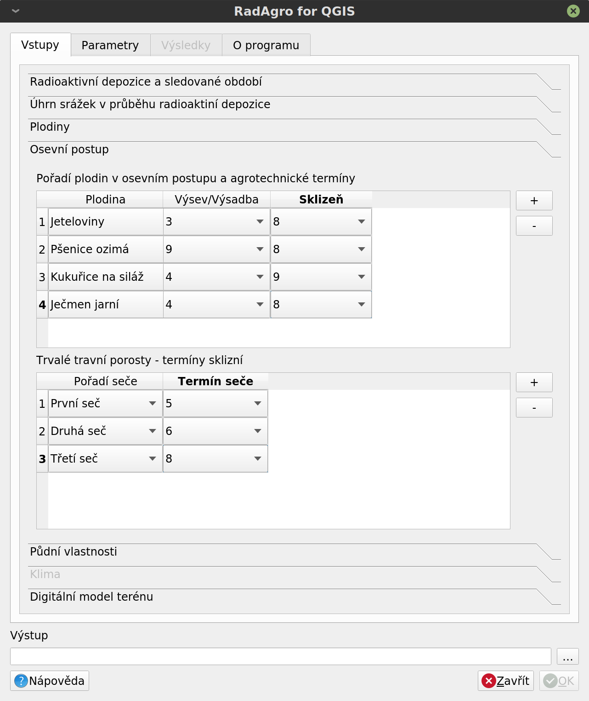

*Ukázka zadání jednoduchého osevního postupu a termínů sklizní trvalých
travních porostů. Všechny termíny jsou zadávány jako měsíce.*

Půdní vlastnosti
+++++++++++++++++

Půdní vlastnosti jsou načítány ve formě rastrové vrstvy obsahující
kódy hlavních půdních jednotek v zájmovém území. Kódy mosí být ve
vrstvě uloženy ve formě celočíselných hodt v rozsahu 1 až 78, podle
klasifikace hlavních půdních jednotek, viz Vyhláška č. 227/2018 Sb.
nebo např. https://bpej.vumop.cz

Vektorová vrstva je uživatelem zvolena z polygonových vrstev
načtených do programu QGIS. Program RadAgro umožňuje též použití
jednotlivých vrstev z geodatabází. Taková vrstva musí být načtena do
prostředí QGIS. Volba vrstvy v programu RadAgro je následující:

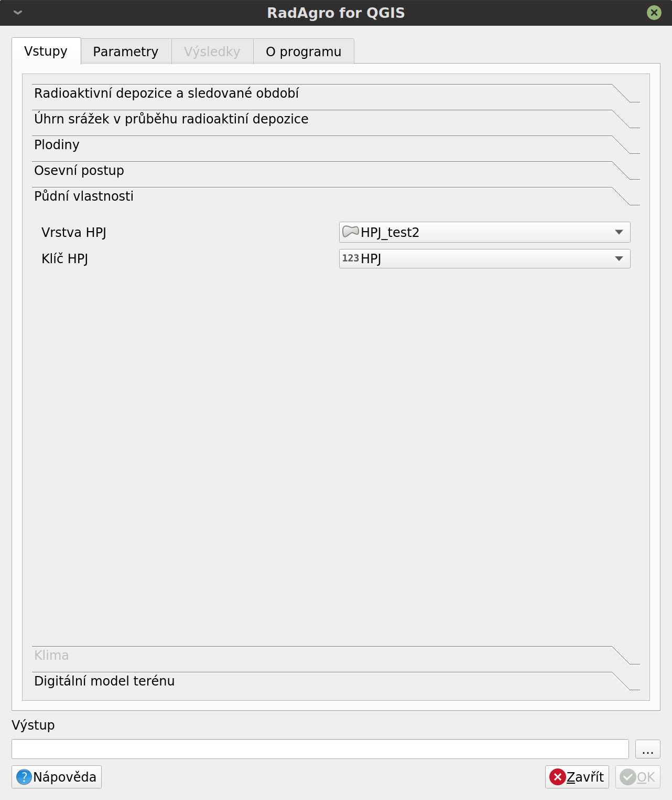

*Vložení vrstvy hlavních půdních jednotek.*

Klima
++++++

Záložka pro zadání klimatických charakteristik je v aktuální verzi
nedostupná. Podrobnosti jsou uvedeny v technické dokumentaci.

Digitální model terénu
+++++++++++++++++++++++

Digitální model terénu je zadáván ve formě rastrové vrstvy. Jedná se
o výškopis v m n. m.  V případě, že je použit vícevrstvý rastr,
program použije pouze první pásmo. Rastrová vrstva se načítá na
základě výběru uživatele z načtených vrstev do programu QGIS. Vložení
vrstvy ukazuje následující obrázek:

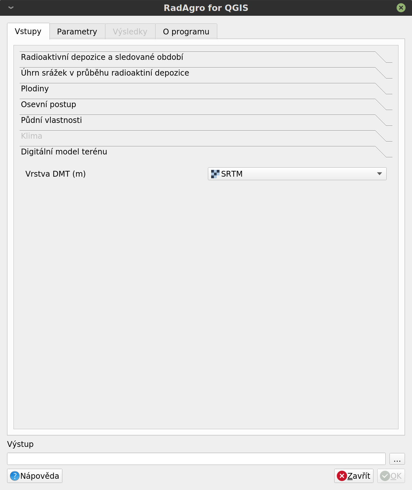

*Vložení vrstvy digitálního modelu terénu*

Nastavení parametrů výpočtu
===========================

Prvním krokem pro nastavení parametrů výpočtu je jejich načtení do
uživatelského prostředí programu RadAgro. Načtení parametrů výpočtu
provedeme v záložce Parametry, pomocí tlačítka Načíst parametry, viz.
obrázek:

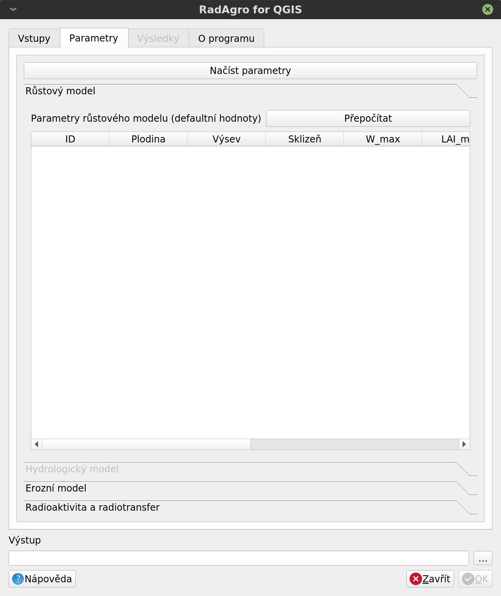

*Nastavení parametrů výpočtu - prázdný formulář. Pro načtení parametrů
výpočtu je potřeba kliknout na tlačítko Načíst parametry.*

Po načtení parametrů výpočtu je možné jednotlivé parametry upravovat a
měnit. Upravovat lze parametry pro růstový model, půdní erozi,
hydrologické charakteristiky a transferové koeficienty.

Růstový model
--------------

Parametry růstového modelu představují zdrojová data pro výpočet
růstových charakteristik plodin, zejména pak sušiny nadzemní biomasy a
indexu listové pokryvnosti pro termín radiační události. Hodnoty
parametrů jsou použity pro výpočet změn radioaktivní kontaminace v
časné fázi radiační události. Podrobnosti k vlastnímu výpočtu jsou
uvedeny v technické dokumentaci. Ukázkázka zadání dat je znázorněna
na následujících obrázcích.

+---------------------------------+---------------------------------+
|.. image:: figs/UI/par_rm1.png   |.. image:: figs/UI/par_rm2.png   |
|    :align: center               |        :align: center           |
|    :scale: 30%                  |        :scale: 30%              |
+---------------------------------+---------------------------------+

*Ukázka nastavení parametrů růstového modelu pro jednotlivé plodiny.
Hodnoty parametrů růstové křivky Koef_m a Koef_n lze automaticky
přepočítat pomocí tlačítka Přepočítat.*

Hydrologický model
-------------------

Formulář pro práci s parametry hydrologického modelu je vaktuální
verzi programu RadAgro nedostupný. Podrobnosti jsou uvedeny v
technické dokumentaci.

Erozní model
-------------

Erozní model použitý v programu RadAgro vychází z Univerzální rovnice
pro výpočet ztráty půdy (Universal Soil Loss Equation, USLE).
Zadávané parametry představují vstupní data pro výpočet nebo
přiřazení jednotlivých faktorů rovnice. Program přiřazuje parametry
pouze zvoleným plodinám, případně Hlavním půdním jednotkám, které
byly zvoleny v části Vstupy. Všechny parametry lze upravovat podle
potřeby a lokálních specifik. Podrobnosti k modelu jsou uvedeny v
technické dokumentaci, případně lze další informace najít v
literatuře (např. Janeček a kol. 2012). Vstupní formulář pro zadání
parametrů erozního modelu ukazuje následující obrázek.

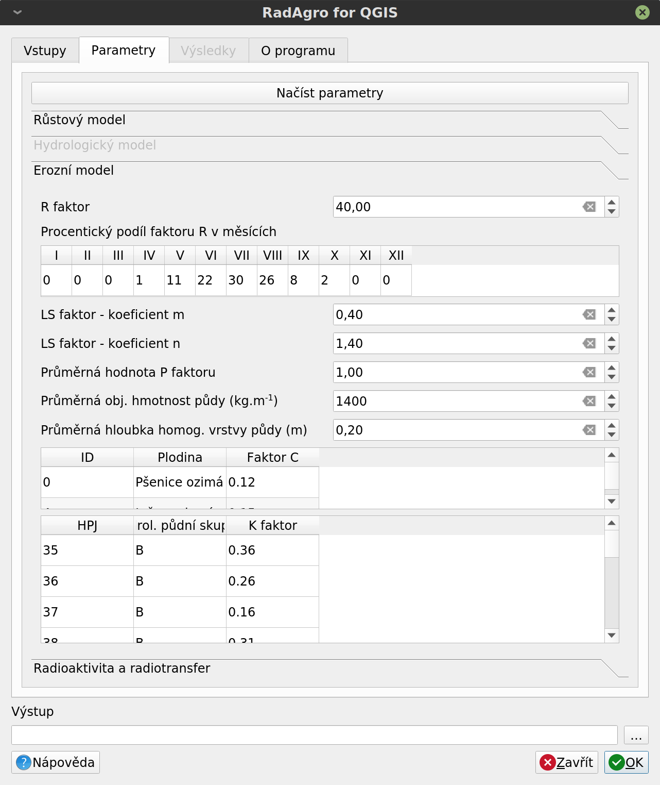

*Obrázek ukazuje zadání parametrů pro výpočet eroze půdy*

Radioaktivita a radiotransfer
------------------------------

List Radioaktivita a radiotransfer obsahuje tabulku přiřazení
transferových koeficientů jednotlivým plodinám. Použity jsou střední
hodnoty získané z literárních zdrojů. Koeficienty je možné upravovat
podle potřeby. Zadání dat ukazuje obrázek.

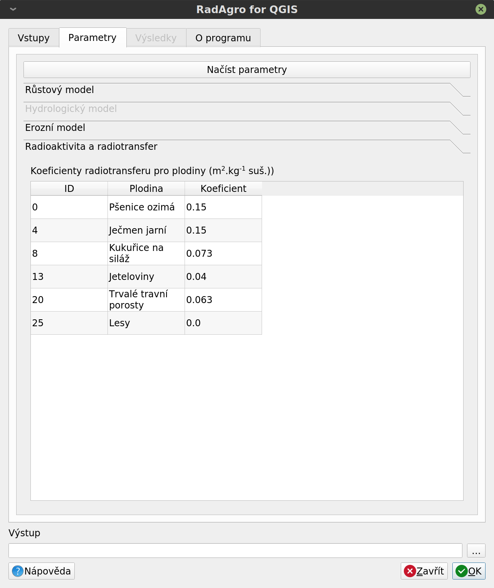

*Zadání parametrů radioaktivního přenosu radionuklidu do nadzemní
biomasy plodin.*

Výstup
-------

Do pole Výstup se zadává cesta k výstupnímu souboru, který bude
vytvořen při výpočtu. Použijte tlačítko pro procházení adresářové
struktury vpravo od textového pole.

Výsledky výpočtu
=================

Výsledkem výpočtu změn radioaktivní depozice je vektorvá vrstva
obsahující informace o časových změnách radioaktivní depozice pro
jednotlivé obsažené polygony. Po provedeném výpočtu si lze
prohlédnout výsledky v záložce Výsledky.

Výpočet výsledků je indikován indikátorem průběhu výpočtu v
informačním řádku programu QGIS, kde je možné průběh výpočtu též
ukončit.

Po dokončení výpočtu se v infromačním řádku programu QGIS zobrazí
možnost načtení vypočtené vrstvy do prostředí QGIS.

Vektorová vrstva
-----------------

Hlavním výsledkem výpočtu je vektorvá vrstva časových změn
radioaktivní kontaminace jednotlivých ploch zájmového území. Plochy
odpovídají původním plochám plodin.

Vektorová vrstva je ukládána ve formátu GeoPackage (GPKG). Jedná se o
moderní geodatabázi založenou na otevřené platformě SQLite3, kterou
lze používat ve většině dostupných GIS softwarech.

Maximální počet predikovaných měsíců v časovém období predikce je
1992, tzn. 166 let.

Následující obrázek ukazuje vektorovou vrstvu vypočtené radioaktivní
kontaminace pro jednotlivé plochy zájmového území a dále je zobrazena
atributová tabulku vrstvy s daty.
Na podkladu snímku je patrná původní rastrová mapa radioaktivní
depozice simulovaná programem HARP RP.

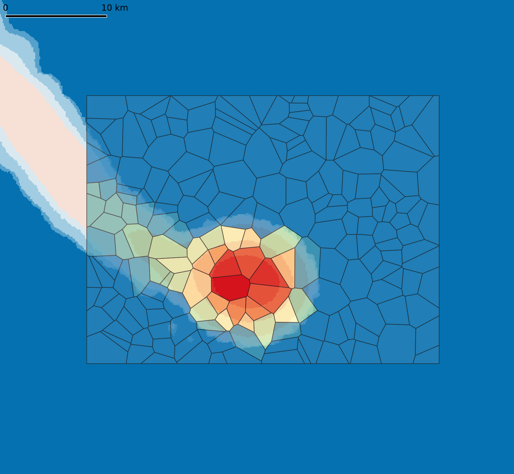

*Vektorová vrstvu vypočtené radioaktivní kontaminace pro jednotlivé
plochy zájmového území. Na podkladu je patrná původní rastrová mapa
radioaktivní depozice simulovaná programem HARP RP. Vektorová vrstva
byla vytvořena formou náhodných Tiessenových polygonů.*

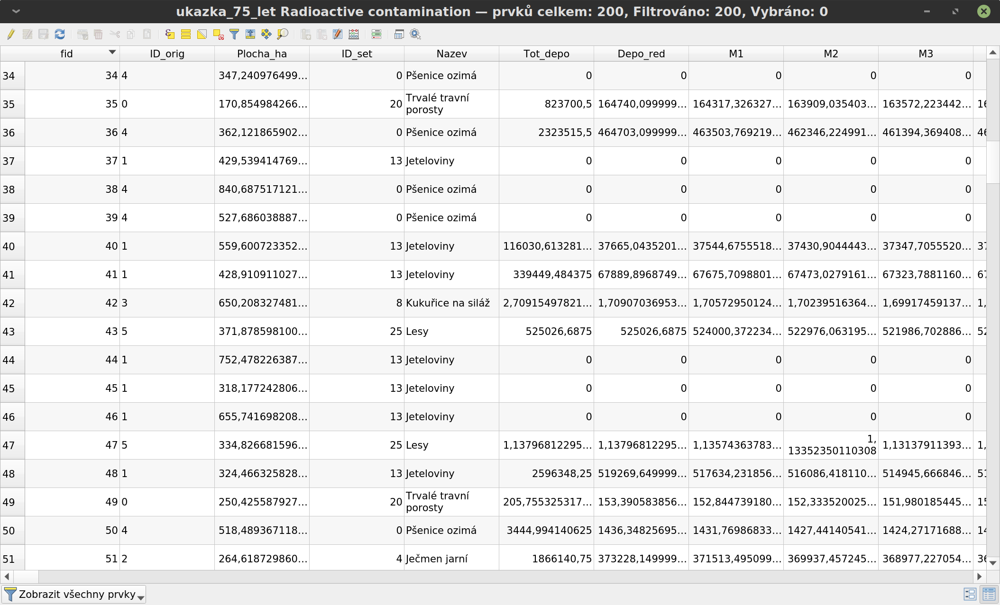

*Atributová tabulka vektorové vrstvy obsahující vypočtená data
radioaktivní kontaminace pro jednotlivé měsíce. Popis významu
jednotlivých sloupců je uveden v textu.*

Atributová tabulka vektorové vrstvy obsahuje následující údaje:

* fid: Identifikační číslo polygonu
* ID_orig: Původní identifikace plodiny, která byla na dané ploše na
  začátku období predikce
* Plocha_ha: Plocha polygonu v ha
* ID_set: Nastavený identifikátor přiřazené plodiny
* Nazev: Název přiřazené plodiny
* Tot_depo: Měrná aktivita radioaktivní depozice :math:`(Bq.m^{-2})`
* Depo_red: Radioaktivní kontaminace :math:`(Bq.m^{-2})` redukovaná
  sklizní nadzemní biomasy plodin v časné fázi radiační události
* M1 - M...: Jednotlivé měsíce predikovaného období

Grafické znázornění výsledků
-----------------------------

Program RadAgro obsahuje záložku Výsedky, která je zpřístupněna po
dokončení výpočtu. Záložka obsahuje grafické znázornění časové řady
pro jednotlivé polygony vektorové vrstvy. Mezi jednotlivými polygony
lze přecházet v rozbalovacím seznamu buď pomocí šipky nebo lze zadat
identifikační číslo (fid) daného polygonu. V grafu lze použít buď
lineární nebo logaritmickou škálu osy Y, na které je vynesena měrná
aktivita radioaktivní kontaminace dané plochy v :math:`Bq.m^{-2}`, na
ose X jsou vyneseny údaje o počádeční úrovni kontaminace (depozice),
o redukované úrovni kontamnace po provedených opatřeních v časné fázi
radiační události a dále je zaznamenán celý predikovaný časový vývoj
radioaktivní depozice. Délka predikované časové řady není omezena.

Dále uvádíme několik ukázek vypočtených výsledků pro příklad
jednoduchého osevního postupu pro polní plochy, ukázku výpočtu pro
kosené trvalé travní porosty a pro les.

+--------------------------------+--------------------------------+
|.. image:: figs/UI/75l_log1.png |.. image:: figs/UI/75l_lin1.png |
|    :align: center              |        :align: center          |
+--------------------------------+--------------------------------+

*Ukázka zobrazení časové řady predikce v průběhu 75 let. Zobrazeny
jsou výsledky pro polní plodiny v logaritmické a lineární škále.*

+--------------------------------+--------------------------------+
|.. image:: figs/UI/75l_lin4.png |.. image:: figs/UI/75l_lin3.png |
|    :align: center              |        :align: center          |
+--------------------------------+--------------------------------+

*Porovnání průběhu vývoje radioaktivní kontaminace v průběhu 75 let
od radiační události. Levý snímek ukazuje průběh v případě lesního
porostu, kde nebyl aplikován žádný management, pravý snímek ukazuje
kosený travní porost. Zde je zajímavostí změna trendu vývoje. Důvodem
je změna managementu s ohledem na přechod plochy z referenční úrovně
3 do referenční úrově 2. V porovnání s vývojem kontaminace polní
plochy na předchozím snímku můžeme vidět zásadní vliv odstranění
kontaminované biomasy v časné fázi radiační události.*

+----------------------------------+----------------------------------+
|.. image:: figs/UI/3r_log2.png    |.. image:: figs/UI/3r_log2_nm.png |
|    :align: center                |        :align: center            |
+----------------------------------+----------------------------------+
|.. image:: figs/UI/3r_log1.png    |.. image:: figs/UI/3r_log1_nm.png |
|    :align: center                |        :align: center            |
+----------------------------------+----------------------------------+

*Porovnání změny kontaminace ve tříletém horizontu v případě
provedeného opatření v časné fázi (odstranění nadzemní biomasy) a v
případě pokračování běžného managementu. Zakřivení křivky v částech
mezi "skoky" je dáno vlivem eroze půdy, pokles pak radioaktivní
přeměnou radionuklidu. Skoky jsou dány odstraněním nadzemní biomasy.
Snímky v horní řadě jsou pro polní plochy, ve spodní řadě pro
trojsečný trvalý travní porost.*

Upozornění: v případě použití vektorového souboru s distribucí plodin
ve formátu ESRI Shapefile může dojít k posunu ID hodnot jednotlivých
polí v grafu. Jestliže soubor neobsahuje FID pole, jsou ID hodnoty
sníženy o jednu jednotku (řada začíná od nuly).
